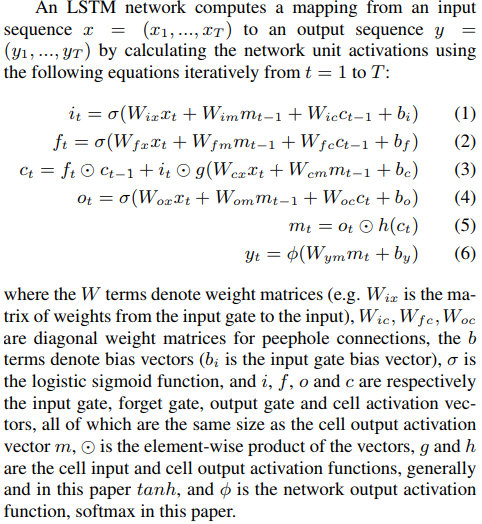

# image
## a
> We're living the future so
---
***
```
我觉得你应该在这里使用`<addr>` 才对。
```

```python {.line-numbers}
a = tf.nn.rnn_cell.MultiRNNCell()
inputs = tf.placeholder(shape=(max_time, batch_size, input_depth),
                        dtype=tf.float32)
sequence_length = tf.placeholder(shape=(batch_size,), dtype=tf.int32)
inputs_ta = tf.TensorArray(dtype=tf.float32, size=max_time)
inputs_ta = inputs_ta.unstack(inputs)
```
- [x] @mentions, #refs, [links](), **formatting**, and <del>tags</del> supported
- [x] list s==yntax== required (any unordered or ordered list supported)
- [x] this is a complete item
- [ ] this is an incomplete item
:smile:
H~2a~a
==marked==
30^th^
*[HTML]: Hyper Text Markup Language
*[W3C]:  World Wide Web Consortium
The HTML specification
is maintained by the W3C.

@import "atest.txt"
@import "1.png"



'''
git config --global user.name hhwowen
git remote add origin git@github.com:hhwowen/yourRepo.git
git add .
git commit -m 'commit new'
git push origin master
'''